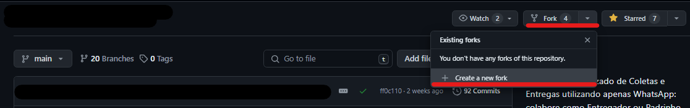

# Projeto Página de Academia

## Índice
- [Visão Geral](#🔍-visão-geral)
  - [Sobre](#📄-sobre-o-projeto)
  - [Screenshot](#📸-screenshot)
  - [Links](#🔗-links)
- [Processo](#📈-processo)
  - [Tecnologia & Ferramentas](#️🛠️-tecnologias-e-ferramentas-utilizadas)
  - [Estrutura & Arquitetura](#🏗-estrutura-e-arquitetura)
- [Como Contribuir](#🤝-como-contribuir)
  - [Diretrizes Gerais](#💼-diretrizes-gerais)
- [Autores](#👥-autores)

## 🔍 Visão Geral
### 📄 Sobre o Projeto
Este projeto é uma iniciativa colaborativa de desenvolvimento web, onde estamos criando um site para uma academia com o objetivo de testar nossas habilidades e aprender sobre integração Full Stack. Utilizando tecnologias de Front-End e Back-End, estamos focados em construir um produto funcional que inclui áreas para alunos e administradores. Nosso intuito é aprimorar nossas habilidades, entender melhor a comunicação entre as camadas de desenvolvimento e melhorar nossa capacidade de trabalho em equipe, tanto no desenvolvimento do projeto quanto na coordenação de uso de um repositório compartilhado, além de criar um portfólio sólido para futuras oportunidades.

### 📸 Screenshot
-

### 🔗 Links
-

## 📈 Processo
### 🛠️ Tecnologias e Ferramentas Utilizadas
<div align='center'>
   
   
   
</div>

### 🏗 Estrutura e Arquitetura
O projeto segue os princípios da **arquitetura limpa**, e o código foi organizado de acordo com os princípios de **modularidade** e **reutilização**.

Além de optar pelo uso de [***conventional commits***](https://www.conventionalcommits.org/pt-br/v1.0.0/) para melhor entendimento e leitura do código de maneira universal

## 🤝 Como Contribuir
### 🌳 Forkando o Repositório
Antes de começar, você **deverá** 'forkar' o repositório do projeto para **seu perfil**.


### 🖨 Clonando seu Repositório
Após o Fork, você **precisará** clonar o repositório 'forkado' para seu **ambiente de desenvolvimento local**:

```
git clone https://github.com/{seu-usuario}/projeto-academia.git
cd projeto-academia
```

### ⏬ Instalando Dependências
Certifique-se de ter **Node.js** instalado no seu sistema. Em seguida, instale as dependências necessárias, utilizando seu respectivo ***gerenciador de pacotes***:

```
npm install

yarn install

pnpm install
```

### 🆕 Criando uma Branch
Antes de iniciar qualquer trabalho, crie uma branch separada para a sua contribuição.

Use um nome descritivo para a sua branch, de preferência, usando [***conventional commits***](#estrutura-e-arquitetura) como base:

```
git checkout -b <type>/<nova-funcionalidade>

git checkout -b feature/nova-funcionalidade
```

### 🔨 Fazendo Alterações
Faça as alterações necessárias no código, adicione novos recursos ou correções de bugs.

### 🧪 Testando (Se necessário)
Garanta que suas alterações não quebraram nenhum recurso existente. Execute os testes e certifique-se de que todos passam:

```
npm run test

yarn test

pnpm test
```

### 📝 Documentando
Mantenha a documentação atualizada. Se você adicionou novos recursos, verifique se eles estão devidamente documentados no README.

### 📊 Compromissos e Push
Após concluir suas alterações e testá-las, faça um commit das alterações, priorizando o uso dos [***conventional commits***](#estrutura-e-arquitetura):

(*Certifique-se de estar na nova branch criada*)
```
git add .
git commit -m <type>: <description>
```

Em seguida, envie suas alterações para o repositório:

```
git push origin <type>/<nova-funcionalidade>
```

### 📨 Solicitando um Pull Request (PR)
Vá para o repositório no GitHub e crie um Pull Request para que sua contribuição seja revisada. Certifique-se de descrever suas alterações e fornecer informações contextuais.

### 👁 Revisão e Fusão
Após criar um Pull Request, nossa equipe revisará suas alterações e fornecerá feedback. Uma vez aprovado, suas alterações serão mescladas no projeto principal.

### 💼 Diretrizes Gerais
- Mantenha o código limpo e legível.
- Siga as boas práticas de desenvolvimento.
- Respeite as convenções de nomenclatura existentes.
- Documente adequadamente as alterações, recursos ou correções.

## 👥 Autores
- **Victor Garcia**
  - [LinkedIn](https://www.linkedin.com/in/victor-fgarcia/)
  - [Perfil GitHub](https://github.com/VFGarciaDev)

- **Caio Padovan**
  - [LinkedIn](https://www.linkedin.com/in/caio-padovan-b28a97262/)
  - [Perfil GitHub](https://github.com/caiopadovan)

#
**_Agradecemos pela sua contribuição e espero que possamos trabalhar juntos para tornar o Projeto ainda melhor. Se você tiver alguma dúvida ou precisar de ajuda, não hesite em entrar em contato conosco. Juntos, podemos criar uma aplicação mais robusta e eficiente._**